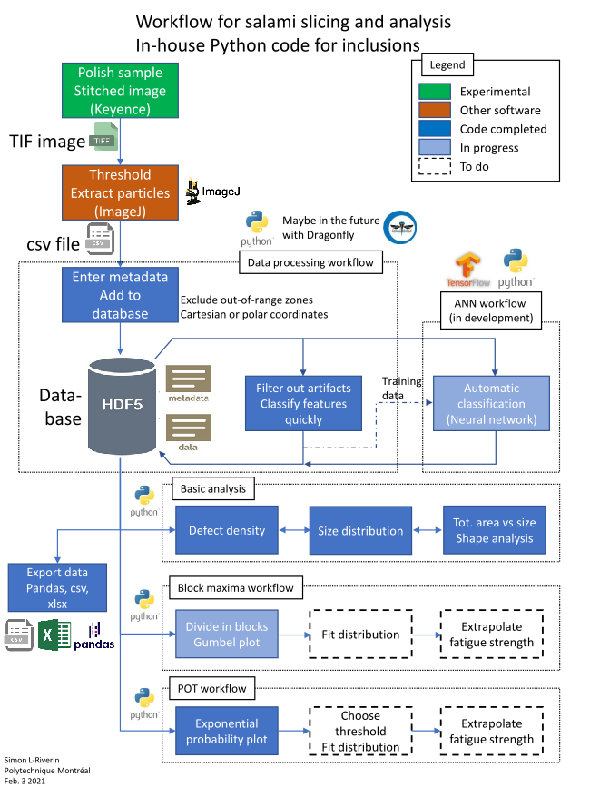

# Readme: Inclusions repository

## General information

The programs in this repository aims at easing data collection and statistical analysis of inclusion data from salami slicing. The image below summarizes the workflow in data analysis from salami slicing, and shows what parts are covered by the present repository, and what is left to develop.

### Before using

Before using the program, the user first has to generate data. The recommended procedure is to mount a metallographic sample and polish it to 0.05 µm in colloidal silica. Then, the surface of the sample should be mapped at a magnification of 100X or more, depending on the size of inclusions. The image should be stitched so that only one file is generated. This can be done with the Keyence microscrope software, or other software. Next, using ImageJ, the user has to increase the contrast in order to isolate the inclusions from the other features. Finally the user can make the image binary and apply a threshold, and then extract a list of particles that can be saved in a .csv file. The requirements of the data file are shown [below](#inclusion-data-files).

### Importing data in the program

The data is centralized in a HDF5 database, in the file `db_incl.h5`. The database is created automatically when importing the data. The data is imported from the .csv files, and those files are not reused after importation. The program will ask the user about metadata from the imported image file (sample identification, slice, sample area...), and then the inclusion data will be stored in the `data` table, and the metadata in the `meta` table. For more details see [below](#h5-database). The importation toolbox offers to the user to select out-of-range zones. Any feature mapped by ImageJ and contained in this area will be wxcluded from the analysis. It is also possible to use polar coordinates in case the cross-section of a sample is round.

### Filtering out the artifacts

Typically, when applying thresholding, artifacts such as scratches, dust and stains can get counted as inclusions. The best way to avoid this is to firstly use sound polishing procedure avoiding scratches and to wash the sample properly with hand soap and dry quickly just before the observation, so that the number of stains and dust particles is kept to a minimum. Since it is not possible to systematically avoir all those, the program comes with an utility to quickly filter out those artifacts. The program shows magnified views of the features to the user in rapid succession, and the user classifies them to the best of his/her know knowledge, so that the artifacts are removed from the analysis.

Attemps had been made to use the classified data to train an artificial neural networks (ANN). This seems to be promising, although work remains to be done. The accuracy of the ANN has not been tested yet, and more data will need to be fed to the model. There always will be uncertainty because even a human user cannot discern dust from inclusion in some cases. More data will need to be fed to the model.

Another application of ANN could be to differentiate types of inclusions automatically, which would allow separate the distributions proper to each inclusion.

### Analysis workflows

The workflows below are being or will be developed for data analysis, and are at different stages of maturity:

* Basic analysis: the program currently has the capacity to generate automatically size statistics for inclusions, as well as kernel density plots showing the repartition of inclusions in function of size.
* Block maxima analysis: Capabilities to separate an image file in blocks have been implemented in cartesian and polar coordinates, but analysis capabilities still need to be developed.
* Peak over threshold: Exponential probability plots can be drawn, but the rest of the analysis needs to be programmed.
* Pitting analysis: An interesting application of this program is the comparison of the same sample before and after pitting. This could allow identification and counting of pits.

## Data description
The data is stored in tabular format. The following describes the fields in the tables used in this program

### H5 database
The database is made of two tables:
* `meta` contains all the metadata from the image file. Each row of the table corresponds to a separate image file.
* `data` lists all the data concerning each individual feature observed on all the images. The features from all the images are grouped in the same table, with fields identifying to which image they belong.

The program takes care of formatting the data and metadata properly before storing them in the database, thus reducing risks of errors. Nevertheless, it is possible for the user to modify data manually if need be (WARNING: there is no UNDO when you make a change to a database, so make sure you know what you are doing). The field headers are case sensitive when manipulated in pandas.

The `meta` table consists of the following fields. Each combination of `ID_specimen` and `slice` is unique.

Field |Data type |Description
---|---|---
ID_specimen |String |Unique identifier for the metallographic specimen
slice |Integer |Sequential number used to identify successive slices of the same specimen, if repolished between 2 observations.
filename |String |Path to the image file used to obtain the data. Must be complete so the program is able to find the picture.
img_width |Float |Width of the image file (µm)
img_height |Float |Height of the image fileé 
img_area_mm2 |Float |Area of image (mm^2). Initially calculated with the dimensions, but any excluded area is substracted.
x_c, y_c |Float |Coordinates (µm) of the center of the specimen (used for circular specimens)
r_outer |Float |Radius of the specimen (µm), for circular specimens
n_divis_x |Integer |Number of divisions in x, or in theta if the sample is circular. Used for block maxima workflow.
n_divis_y |Integer |Number of divisions in y. Not used for polar coordinates
divis_area_mm2 |Float |Area of the divisions (mm2)

The `data` table contains the following fields. Each combination of `ID_specimen`, `slice` and `incl_nb` is unique.

Field |Data type |Description
---|---|---
ID_specimen |String |Unique identifier for the metallographic specimen
slice |Integer |Sequential number used to identify successive slices of the same specimen, if repolished between 2 observations.
incl_nb |Integer |Index of feature/inclusion
x, y |Float |Coordinates of feature (µm)
area |Float |Area of feature (µm^2)
feret |Float |Feret diameter (µm^2)
min_feret|Float|Minimum distance between 2 points on the boundary
feret_angle|Float|Angle of 0 to 180° between feret diameter and a horizontal line (°)
circ|Float|Circularity. A value of 1.0 for a perfect circle, and close to zero if very elongated
round|Float|Roundness. Inverse of aspect ratio
ar|Float|Aspect ratio. Ratio of max to min axes of an ellipse fitted to the contour of the feature
solid|Float|Indicator of convexity. Ratio of area over convex area.
incl_type |Categorical |Classification of the type of feature (inclusion, porosity, dust, scratch, ...)
r |Float |Radial coordinate of feature, if sample circular (µm)
theta |Float |Azimuthal coordinate of feature, if sample is circular (°)
division |Integer |To which division (block) belongs the feature (for block maxima workflow)

### Data logger

There is no UNDO operations in a database, however a datalogger was added to this repository. Every change made to the database is automatically timestamped and logged with a text description in `db_incl.log`. If any unwanted change was to occur, it is possible to see exactly what change has been made and revert it back manually. Eventually, another option would be to playback the log file and rebuilt the database from the original data. This is not implemented yet.

### Inclusion data files

The following applies to .csv files to be imported in the database. It is important to have the right column headers (case sensitive). See [ImageJ user guide](https://imagej.nih.gov/ij/docs/guide/146-30.html#toc-Subsection-30.2) for more info on shape descriptors.

Column header | Data type   | Description
--- | --- | ---
(blank) |Integer  |Index of feature/inclusion
X, Y  |Float  |Coordinates of feature (µm)
Area  |Float  |Area of feature (µm^2)
Feret |Float  |Feret diameter (longest distance between 2 points on the boundary) (µm)
MinFeret|Float|Minimum distance between 2 points on the boundary
FeretAngle|Float|Angle of 0 to 180° between feret diameter and a horizontal line (°)
Circ.|Float|Circularity. A value of 1.0 for a perfect circle, and close to zero if very elongated
AR|Float|Aspect ratio. Ratio of max to min axes of an ellipse fitted to the contour of the feature
Round|Float|Roundness. Inverse of aspect ratio
Solidity|Float|Indicator of convexity. Ratio of area over convex area.
